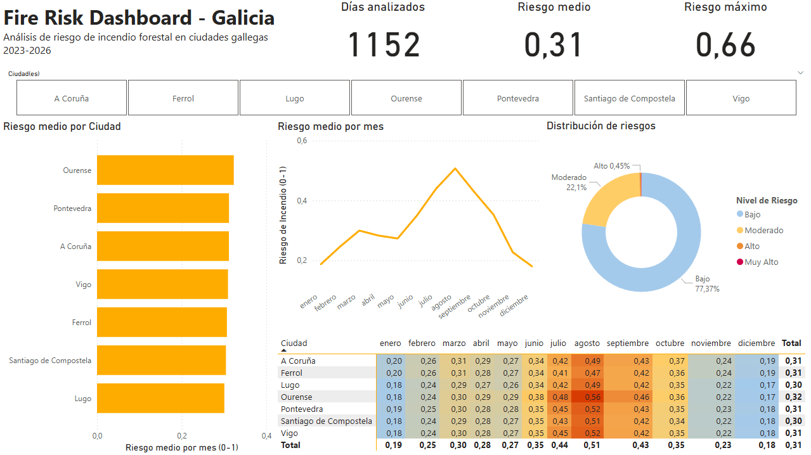

# Fire Risk Pipeline

Pipeline ETL construido con Apache Airflow que extrae datos meteorológicos diarios de la API Open-Meteo, calcula el índice de riesgo de incendio forestal para las 7 ciudades gallegas y almacena los resultados en AWS S3 siguiendo una arquitectura medallion (Bronze/Silver/Gold). Los datos se consultan con Amazon Athena y se visualizan en un dashboard interactivo de Power BI.

Proyecto complementario a [forestfire-cv-detection](https://github.com/AaronPrado/forestfire-cv-detection) (YOLOv8 + MLflow + FastAPI).



## Stack Tecnológico

| Componente | Tecnología |
|---|---|
| Orquestación | Apache Airflow 2.10.4 (LocalExecutor) |
| Almacenamiento | AWS S3 (capas Bronze / Silver / Gold) |
| Consulta de datos | Amazon Athena (SQL serverless sobre S3) |
| Visualización | Power BI Desktop (ODBC + Athena) |
| Alertas | AWS SNS (notificaciones por email) |
| Fuente de datos | [Open-Meteo API](https://open-meteo.com/)  |
| Contenedores | Docker + Docker Compose |
| Lenguaje | Python 3.11 |
| Tests | pytest|

## Arquitectura

```
Open-Meteo API
      |
      v
  [Airflow DAG]
      |
      v
  S3 Bronze ──> S3 Silver ──> S3 Gold ──> SNS Alert
  (raw JSON)   (clean Parquet) (risk Parquet)   |
                                    |            |
                                    v            v
                                 Athena       Email
                                    |
                                    v
                                Power BI
```

## Estructura del Proyecto

```
fire-risk-pipeline/
├── configs/
│   └── config.yaml              # Configuración centralizada (ciudades, variables, pesos, AWS)
├── dags/
│   └── fire_risk_daily.py       # DAG principal de Airflow (4 tasks)
├── docker/
│   ├── docker-compose.yml       # Servicios Airflow + PostgreSQL
│   └── Dockerfile               # Imagen custom de Airflow
├── scripts/
│   └── backfill.py              # Script de backfill histórico (2023-2026)
├── sql/
│   ├── create_database.sql      # Crear base de datos en Athena
│   ├── create_table.sql         # Crear tabla externa sobre S3
│   └── repair_partitions.sql    # Descubrir particiones en Glue metastore
├── src/
│   ├── alerts/
│   │   └── sns_alert.py         # Envío de alertas SNS por riesgo alto
│   ├── extractors/
│   │   └── open_meteo.py        # Cliente de la API Open-Meteo (forecast + archive)
│   ├── transformers/
│   │   ├── validators.py        # Validación y limpieza de datos
│   │   └── risk_calculator.py   # Cálculo de índice de riesgo
│   └── utils/
│       └── config.py            # Cargador de configuración YAML
├── tests/
│   ├── test_open_meteo.py       # Tests del cliente Open-Meteo
│   ├── test_risk_calculator.py  # Tests del cálculo de riesgo
│   └── test_validators.py       # Tests de validación
├── fire-risk.pbix               # Dashboard de Power BI
├── .env.example                 # Plantilla de variables de entorno
└── requirements.txt             # Dependencias Python
```

## Cobertura Geográfica

Ciudades gallegas: A Coruña, Ferrol, Lugo, Ourense, Santiago de Compostela, Pontevedra, Vigo.

## Variables Meteorológicas

| Variable | Relevancia |
|---|---|
| `temperature_2m_max` | Temperaturas altas secan la vegetación |
| `temperature_2m_min` | Indicador de amplitud térmica |
| `relative_humidity_2m_mean` | Humedad baja aumenta el riesgo |
| `precipitation_sum` | Falta de lluvia aumenta el riesgo |
| `wind_speed_10m_max` | El viento propaga el fuego |
| `wind_gusts_10m_max` | Rachas extremas = riesgo extremo |
| `et0_fao_evapotranspiration` | Pérdida de humedad del suelo/vegetación |

## Cálculo de Riesgo

El índice de riesgo se calcula mediante un FWI (Fire Weather Index) simplificado:

1. **Normalización** de cada variable a escala 0-1
2. **Inversión** de humedad y precipitación (más = menos riesgo)
3. **Suma ponderada** con pesos configurables por variable
4. **Factor estacional** basado en el patrón bimodal de incendios en Galicia (picos en marzo y agosto)
5. **Clasificación** en 5 niveles: low, moderate, high, very_high, extreme

Los resultados fueron validados contra datos reales del [IRDI de la Xunta de Galicia](https://mediorural.xunta.gal/es/temas/defensa-monte/irdi) (Índice de Riesgo Diario de Incendio), confirmando que los patrones estacionales y geográficos del modelo coinciden con los incendios reales registrados en 2024.

## Pipeline (DAG)

```
extract_weather ──> validate_weather ──> calculate_risk ──> check_and_alert
    (Bronze)            (Silver)             (Gold)            (SNS)
```

| Tarea | Entrada | Salida |
|---|---|---|
| `extract_weather` | Open-Meteo API | `bronze/weather/{fecha}/raw.json` |
| `validate_weather` | JSON raw | `silver/weather/{fecha}/clean.parquet` |
| `calculate_risk` | Parquet limpio | `gold/fire_risk/year={Y}/month={M}/day={D}/risk.parquet` |
| `check_and_alert` | Parquet de riesgo | Alerta SNS si hay riesgo alto/muy alto/extremo |

La capa Gold usa **particionado Hive** (`year=YYYY/month=MM/day=DD/`) para optimizar las consultas en Athena y reducir costes de escaneo.

## Backfill Histórico

El script `scripts/backfill.py` extrae datos históricos desde 2023 hasta 2026 usando la [Archive API de Open-Meteo](https://archive-api.open-meteo.com/), ejecuta la validación y cálculo de riesgo, y sube los resultados a S3 en formato Hive partitioned. Esto genera **8064 registros** (7 ciudades x ~1152 días).

## Athena

Los scripts SQL en `sql/` permiten configurar Amazon Athena para consultar los datos de la capa Gold directamente sobre S3:

1. `create_database.sql` - Crea la base de datos `fire_risk`
2. `create_table.sql` - Crea la tabla externa `daily_risk` sobre los Parquets particionados
3. `repair_partitions.sql` - Ejecuta `MSCK REPAIR TABLE` para descubrir las particiones Hive en el Glue metastore

### Permisos IAM necesarios

La policy del usuario IAM requiere estos permisos:

- **S3**: `PutObject`, `GetObject`, `DeleteObject`, `ListBucket`, `GetBucketLocation`
- **SNS**: `Publish` (sobre el topic de alertas)
- **Athena**: `StartQueryExecution`, `GetQueryExecution`, `GetQueryResults`, `StopQueryExecution`, `GetWorkGroup`
- **Glue**: `GetDatabase`, `GetDatabases`, `GetTable`, `GetTables`, `GetPartitions`

## Power BI Dashboard

El dashboard (`fire-risk.pbix`) se conecta a Athena vía ODBC y muestra:

- **KPIs**: Días analizados (1152), riesgo medio (0.31), riesgo máximo registrado (0.66)
- **Línea temporal**: Evolución del riesgo medio por mes (pico en agosto, pico secundario en marzo)
- **Barras por ciudad**: Riesgo medio por ciudad (Ourense y Pontevedra lideran)
- **Donut de distribución**: Proporción de niveles de riesgo (~75% bajo, ~25% moderado)
- **Heatmap**: Matriz ciudad x mes con formato condicional (rojo = mayor riesgo)
- **Filtro interactivo**: Segmentador por ciudad que filtra todos los gráficos

### Configuración de Power BI

1. Instalar el [driver ODBC de Amazon Athena](https://docs.aws.amazon.com/athena/latest/ug/odbc-v2-driver.html)
2. Configurar un DSN de sistema "Amazon Athena" con región `eu-west-1`, S3 output location y credenciales IAM
3. En Power BI: `Obtener datos` > `ODBC` > seleccionar el DSN
4. En Power Query: cambiar columnas numéricas de Texto a Número Decimal y "time" a fecha

## Alertas SNS

Cuando el DAG detecta riesgo **alto**, **muy alto** o **extremo** en alguna ciudad, envía automáticamente una alerta por email vía Amazon SNS con el detalle de las ciudades afectadas y su índice de riesgo.

## Instalación

1. Clona el repositorio
2. Copia `.env.example` a `.env` y rellena tus credenciales AWS:
   ```
   AWS_ACCESS_KEY_ID=tu_access_key
   AWS_SECRET_ACCESS_KEY=tu_secret_key
   AWS_DEFAULT_REGION=eu-west-1
   ```
3. Arranca Airflow:
   ```bash
   cd docker
   docker compose --env-file ../.env up --build
   ```
4. Accede a la UI en `http://localhost:8080` (admin/admin)

## Tests

```bash
pytest tests/ -v
```

36 tests cubriendo:
- **Extracción**: Respuestas HTTP, manejo de errores, construcción de URLs
- **Validación**: Rangos, nulos, valores límite, múltiples localizaciones
- **Riesgo**: Normalización, pesos, factor estacional, umbrales, integración

## Despliegue en Producción (no implementado)

Para poner este pipeline en producción, la arquitectura recomendada sería:

- **EC2**: Instancia con Docker instalado ejecutando Airflow 24/7
- **Security Groups**: Puerto 8080 (Airflow UI) restringido por IP
- **Schedule**: El DAG `fire_risk_daily` se ejecuta automáticamente cada día vía el scheduler de Airflow

Esta parte no se implementó porque el foco del proyecto es el pipeline de datos y la ingeniería (ETL, testing, particionado, alertas, visualización), no la infraestructura de despliegue. La ejecución local con Docker Compose es funcionalmente equivalente a la de producción.