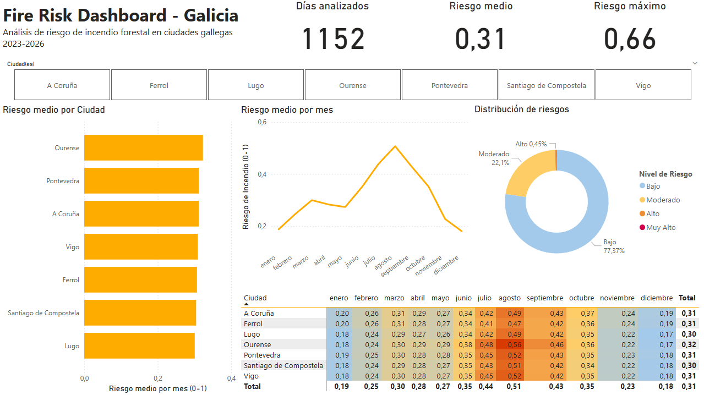
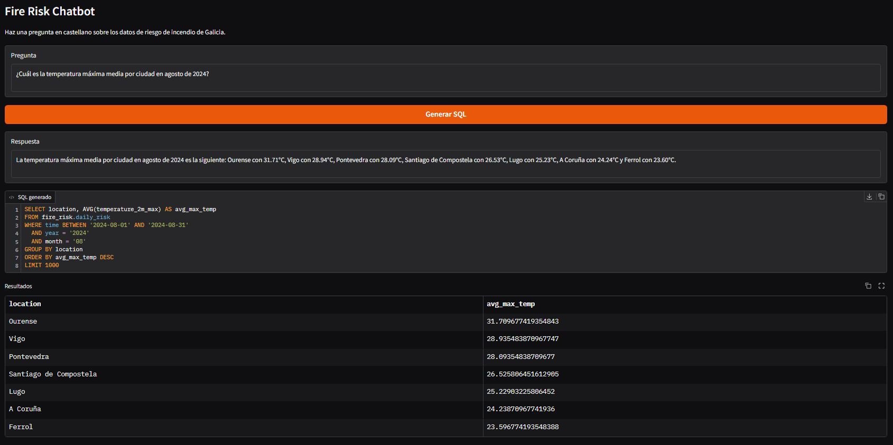

# Fire Risk Pipeline

Pipeline ETL construido con Apache Airflow que extrae datos meteorológicos diarios de la API Open-Meteo, calcula el índice de riesgo de incendio forestal para las 7 ciudades gallegas y almacena los resultados en AWS S3 siguiendo una arquitectura medallion (Bronze/Silver/Gold). Los datos se consultan con Amazon Athena, se visualizan en un dashboard interactivo de Power BI, y pueden consultarse en lenguaje natural mediante un chatbot con LLM local.

Proyecto complementario a [forestfire-cv-detection](https://github.com/AaronPrado/forestfire-cv-detection) (YOLOv8 + MLflow + FastAPI).



## Stack Tecnológico

### Pipeline ETL

| Componente | Tecnología |
|---|---|
| Orquestación | Apache Airflow 2.10.4 (LocalExecutor) |
| Almacenamiento | AWS S3 (capas Bronze / Silver / Gold) |
| Consulta de datos | Amazon Athena (SQL serverless sobre S3) |
| Visualización | Power BI Desktop (ODBC + Athena) |
| Alertas | AWS SNS (notificaciones por email) |
| Fuente de datos | [Open-Meteo API](https://open-meteo.com/)  |
| Contenedores | Docker + Docker Compose |
| Lenguaje | Python 3.11 |
| Tests | pytest |

### Chatbot

| Componente | Tecnología |
|---|---|
| LLM local | Ollama + qwen2.5-coder:7b |
| Framework LLM | LangChain 1.3.1 + langchain-ollama 1.1.0 |
| Interfaz web | Gradio 6.14.0 |
| Parsing SQL | sqlglot 30.8.0 |
| Cliente Athena | pyathena 3.30.1 |
| Lenguaje | Python 3.12 |

## Arquitectura

```
Open-Meteo API
      |
      v
  [Airflow DAG]
      |
      v
  S3 Bronze ──> S3 Silver ──> S3 Gold ──> SNS Alert
  (raw JSON)   (clean Parquet) (risk Parquet)   |
                                    |            |
                                    v            v
                                 Athena       Email
                                  /    \
                                 v      v
                            Power BI   Chatbot
                                       (LLM local)
```

## Estructura del Proyecto

```
fire-risk-pipeline/
├── configs/
│   └── config.yaml              # Configuración centralizada (ciudades, variables, pesos, AWS)
├── dags/
│   └── fire_risk_daily.py       # DAG principal de Airflow (4 tasks)
├── docker/
│   ├── docker-compose.yml       # Servicios Airflow + PostgreSQL
│   └── Dockerfile               # Imagen custom de Airflow
├── scripts/
│   └── backfill.py              # Script de backfill histórico (2023-2026)
├── sql/
│   ├── create_database.sql      # Crear base de datos en Athena
│   ├── create_table.sql         # Crear tabla externa sobre S3
│   └── repair_partitions.sql    # Descubrir particiones en Glue metastore
├── src/
│   ├── alerts/
│   │   └── sns_alert.py         # Envío de alertas SNS por riesgo alto
│   ├── extractors/
│   │   └── open_meteo.py        # Cliente de la API Open-Meteo (forecast + archive)
│   ├── transformers/
│   │   ├── validators.py        # Validación y limpieza de datos
│   │   └── risk_calculator.py   # Cálculo de índice de riesgo
│   └── utils/
│       └── config.py            # Cargador de configuración YAML
├── tests/
│   ├── test_open_meteo.py       # Tests del cliente Open-Meteo
│   ├── test_risk_calculator.py  # Tests del cálculo de riesgo
│   └── test_validators.py       # Tests de validación
├── chatbot/                     # Chatbot analítico (módulo GenAI)
│   ├── app.py                   # Interfaz Gradio
│   ├── eval/
│   │   ├── few_shot_examples.jsonl  # Ejemplos para el prompt del LLM
│   │   ├── dataset.jsonl            # Dataset de evaluación
│   │   └── run_eval.py              # Script de evaluación de accuracy
│   ├── src/
│   │   ├── athena/executor.py   # Ejecución de queries en Athena
│   │   ├── llm/
│   │   │   ├── client.py        # Cliente Ollama (ChatOllama)
│   │   │   ├── prompts.py       # System prompt con catálogo + few-shot
│   │   │   └── generator.py     # Orquestador NL → SQL validado
│   │   ├── schema/catalog.py    # Catálogo dinámico desde DDL + config.yaml
│   │   └── sql/validator.py     # Validador de seguridad SQL
│   ├── tests/                   # Tests con dependencias mockeadas
│   └── requirements.txt         # Dependencias del módulo
├── fire-risk.pbix               # Dashboard de Power BI
├── .env.example                 # Plantilla de variables de entorno (pipeline)
└── requirements.txt             # Dependencias Python (pipeline)
```

## Cobertura Geográfica

Ciudades gallegas: A Coruña, Ferrol, Lugo, Ourense, Santiago de Compostela, Pontevedra, Vigo.

## Variables Meteorológicas

| Variable | Relevancia |
|---|---|
| `temperature_2m_max` | Temperaturas altas secan la vegetación |
| `temperature_2m_min` | Indicador de amplitud térmica |
| `relative_humidity_2m_mean` | Humedad baja aumenta el riesgo |
| `precipitation_sum` | Falta de lluvia aumenta el riesgo |
| `wind_speed_10m_max` | El viento propaga el fuego |
| `wind_gusts_10m_max` | Rachas extremas = riesgo extremo |
| `et0_fao_evapotranspiration` | Pérdida de humedad del suelo/vegetación |

## Cálculo de Riesgo

El índice de riesgo se calcula mediante un FWI (Fire Weather Index) simplificado:

1. **Normalización** de cada variable a escala 0-1
2. **Inversión** de humedad y precipitación (más = menos riesgo)
3. **Suma ponderada** con pesos configurables por variable
4. **Factor estacional** basado en el patrón bimodal de incendios en Galicia (picos en marzo y agosto)
5. **Clasificación** en 5 niveles: low, moderate, high, very_high, extreme

Los resultados fueron validados contra datos reales del [IRDI de la Xunta de Galicia](https://mediorural.xunta.gal/es/temas/defensa-monte/irdi) (Índice de Riesgo Diario de Incendio), confirmando que los patrones estacionales y geográficos del modelo coinciden con los incendios reales registrados en 2024.

## Pipeline (DAG)

```
extract_weather ──> validate_weather ──> calculate_risk ──> check_and_alert
    (Bronze)            (Silver)             (Gold)            (SNS)
```

| Tarea | Entrada | Salida |
|---|---|---|
| `extract_weather` | Open-Meteo API | `bronze/weather/{fecha}/raw.json` |
| `validate_weather` | JSON raw | `silver/weather/{fecha}/clean.parquet` |
| `calculate_risk` | Parquet limpio | `gold/fire_risk/year={Y}/month={M}/day={D}/risk.parquet` |
| `check_and_alert` | Parquet de riesgo | Alerta SNS si hay riesgo alto/muy alto/extremo |

La capa Gold usa **particionado Hive** (`year=YYYY/month=MM/day=DD/`) para optimizar las consultas en Athena y reducir costes de escaneo.

## Backfill Histórico

El script `scripts/backfill.py` extrae datos históricos desde 2023 hasta 2026 usando la [Archive API de Open-Meteo](https://archive-api.open-meteo.com/), ejecuta la validación y cálculo de riesgo, y sube los resultados a S3 en formato Hive partitioned. Esto genera **8064 registros** (7 ciudades x ~1152 días).

## Athena

Los scripts SQL en `sql/` permiten configurar Amazon Athena para consultar los datos de la capa Gold directamente sobre S3:

1. `create_database.sql` - Crea la base de datos `fire_risk`
2. `create_table.sql` - Crea la tabla externa `daily_risk` sobre los Parquets particionados
3. `repair_partitions.sql` - Ejecuta `MSCK REPAIR TABLE` para descubrir las particiones Hive en el Glue metastore

### Permisos IAM necesarios

La policy del usuario IAM requiere estos permisos:

- **S3**: `PutObject`, `GetObject`, `DeleteObject`, `ListBucket`, `GetBucketLocation`
- **SNS**: `Publish` (sobre el topic de alertas)
- **Athena**: `StartQueryExecution`, `GetQueryExecution`, `GetQueryResults`, `StopQueryExecution`, `GetWorkGroup`
- **Glue**: `GetDatabase`, `GetDatabases`, `GetTable`, `GetTables`, `GetPartitions`

## Power BI Dashboard

El dashboard (`fire-risk.pbix`) se conecta a Athena vía ODBC y muestra:

- **KPIs**: Días analizados (1152), riesgo medio (0.31), riesgo máximo registrado (0.66)
- **Línea temporal**: Evolución del riesgo medio por mes (pico en agosto, pico secundario en marzo)
- **Barras por ciudad**: Riesgo medio por ciudad (Ourense y Pontevedra lideran)
- **Donut de distribución**: Proporción de niveles de riesgo (~75% bajo, ~25% moderado)
- **Heatmap**: Matriz ciudad x mes con formato condicional (rojo = mayor riesgo)
- **Filtro interactivo**: Segmentador por ciudad que filtra todos los gráficos

### Configuración de Power BI

1. Instalar el [driver ODBC de Amazon Athena](https://docs.aws.amazon.com/athena/latest/ug/odbc-v2-driver.html)
2. Configurar un DSN de sistema "Amazon Athena" con región `eu-west-1`, S3 output location y credenciales IAM
3. En Power BI: `Obtener datos` > `ODBC` > seleccionar el DSN
4. En Power Query: cambiar columnas numéricas de Texto a Número Decimal y "time" a fecha

## Chatbot Analítico

El módulo `chatbot/` añade una interfaz conversacional sobre los datos de Athena. El usuario hace preguntas en castellano (por ejemplo, *"¿Cuál fue el día más lluvioso de 2024?"*) y el sistema genera SQL, lo ejecuta, y devuelve los resultados como tabla acompañados de una respuesta en lenguaje natural generada por el mismo LLM.



### Arquitectura del chatbot

```
Pregunta en castellano
        |
        v
  [Gradio UI]
        |
        v
  generate_sql() ──> Ollama (qwen2.5-coder:7b)
        |
        v
  validate_sql() ──> Reglas de seguridad
        |
        v
   run_query() ──> Amazon Athena
        |
        v
   interpret() ──> Ollama (resumen en lenguaje natural)
        |
        v
  Headline + DataFrame en la UI
```

### Características de seguridad

El validador SQL aplica 6 reglas antes de ejecutar cualquier query en Athena:

1. **Sintaxis válida** mediante parsing con sqlglot
2. **Solo SELECT** (rechaza INSERT, UPDATE, DELETE, DROP, CREATE)
3. **Whitelist de tablas** (solo `fire_risk.daily_risk`)
4. **Whitelist de columnas** generada dinámicamente desde el DDL
5. **Partition pruning obligatorio** cuando se filtra por `time`: igualdad (`time = X`) exige `year + month + day`; rango (BETWEEN, >=, <=) exige al menos `year`
6. **LIMIT inyectado/reemplazado** con `MAX_LIMIT = 1000`

Esto previene UNION attacks, subqueries a tablas del sistema, full scans accidentales sobre todas las particiones, y consultas con cardinalidad descontrolada.

### Catálogo dinámico

El system prompt incluye un catálogo de la tabla generado en tiempo de carga desde:

- `sql/create_table.sql` — columnas, tipos y particiones
- `configs/config.yaml` — nombres canónicos de las ciudades gallegas

Esto garantiza que el LLM siempre tenga el schema actualizado sin necesidad de mantenerlo sincronizado a mano.

### Calidad de la generación SQL

Más allá del validador, el system prompt enseña al LLM tres patrones específicos que mejoran la calidad del SQL generado:

1. **Catalog-first** — antes de calcular una métrica derivada, debe comprobar si ya existe la columna. Ejemplo: la humedad media usa `relative_humidity_2m_mean` directamente; la temperatura media (que no existe como columna) se calcula como `(temperature_2m_max + temperature_2m_min) / 2`. Esto previene la alucinación de columnas inexistentes.

2. **GROUP BY automático** — cuando el SELECT mezcla columnas no-agregadas con funciones agregadas (MAX, AVG, COUNT...), el LLM añade `GROUP BY` con las no-agregadas. Esto previene errores tipo `EXPRESSION_NOT_AGGREGATE` de Athena.

3. **ORDER BY + LIMIT 1 cuando se pide un único resultado** — si la pregunta pide solo un resultado (*"¿qué ciudad tuvo más X?"*), el LLM añade `ORDER BY` por el agregado y `LIMIT 1` para devolverlo directamente en vez de una lista sin ordenar.

### Interpretación en lenguaje natural

Además de la tabla de resultados, el chatbot genera una **respuesta en lenguaje natural** que resume los datos en una o dos frases. La interpretación se hace con el mismo LLM local pasándole la pregunta original y los resultados.

Detalles de implementación:

- **DataFrames grandes**: se truncan a 20 filas antes de enviarlos al LLM, indicando el total en una nota (`mostrando 20 de 100 filas`) para que el modelo sepa que ve un subconjunto.
- **Resultados vacíos**: se devuelve el mensaje `"La consulta no devolvió resultados."` sin llamar al LLM.
- **Errores del LLM**: se capturan en silencio y se devuelve cadena vacía. La tabla sigue visible para que el usuario tenga la verdad de los datos.

El headline es **orientativo**: la tabla de resultados es siempre la fuente de verdad.

### Evaluación

El dataset `chatbot/eval/dataset.jsonl` contiene 12 preguntas representativas que cubren:

- Agregaciones (AVG, SUM, MAX, COUNT)
- Filtros numéricos y categóricos
- Patrón "ganador único" (GROUP BY + ORDER BY + LIMIT 1)
- Rangos de fechas con partition pruning
- Trampas conocidas: traducción de niveles de riesgo (alto → high), nombres de ciudad (Coruña → A Coruña), uso de particiones en vez de funciones de fecha

```bash
python -m chatbot.eval.run_eval
```

Accuracy actual: **50% exact-match**, **~83% funcional** descontando variaciones válidas (aliases distintos, orden de cláusulas WHERE, ORDER BY equivalentes, omisión de columnas no esenciales).

Los fallos reales del modelo (sobreajuste ocasional a un few-shot, omisión de columnas relevantes en el SELECT) son inherentes al tamaño del LLM (7B parámetros) y se documentan en la sección de limitaciones.

### Limitaciones conocidas

El chatbot usa un modelo local de 7B parámetros (qwen2.5-coder), elegido por privacidad y coste cero. Estas son las limitaciones inherentes documentadas durante el desarrollo:

**Del intérprete en lenguaje natural:**

- **Redondeo con valores próximos**: cuando dos valores son casi iguales tras redondear (ej. 0.301 vs 0.305 → ambos `0.30`), el headline puede atribuir el extremo a la ciudad incorrecta. La tabla exacta debajo siempre tiene los valores correctos.
- **Síntesis de listas largas**: con 50+ filas el LLM tiende a colapsar la respuesta a los primeros valores en vez de resumir el patrón global.
- **Confusión de unidades**: el LLM puede inferir mal las unidades cuando no están especificadas en el catálogo (ej. interpretar `wind_speed_10m_max` como m/s cuando los valores reales son km/h). Los datos numéricos en la tabla son siempre correctos; solo el texto del headline puede confundirlas.

**Del generador SQL:**

- **Fechas relativas**: expresiones como *"los últimos 2 años"* o *"este mes"* pueden resolverse con desfase de uno o dos años respecto a la fecha actual, aunque el prompt incluye la fecha de hoy explícita.
- **Sobreajuste al few-shot**: ocasionalmente el LLM añade filtros que no están en la pregunta si un few-shot similar los incluía (ej. añadir `location = 'Vigo'` a una pregunta sin ciudad porque el ejemplo análogo del prompt sí la tenía).
- **Ambigüedad de "qué ciudades"**: el LLM puede devolver pares (ciudad, día) en vez de la lista distinta de ciudades. Reformular como *"lista las ciudades únicas que..."* normalmente lo corrige.

**Decisión de diseño:** todas estas limitaciones se aceptan en lugar de mitigarse con código adicional (reglas más complejas en el prompt, pre-cálculo en Python, modelo más grande). La razón es que el chatbot es una demostración educativa del flujo NL→SQL→datos→NL, no un producto. La tabla siempre está disponible como fuente de verdad y compensa los fallos del headline.

### Ejecución del chatbot

```bash
ollama serve            # Arrancar el servidor local de Ollama
python -m chatbot.app   # Lanzar la interfaz Gradio
```

La UI queda disponible en `http://127.0.0.1:7860`.

## Alertas SNS

Cuando el DAG detecta riesgo **alto**, **muy alto** o **extremo** en alguna ciudad, envía automáticamente una alerta por email vía Amazon SNS con el detalle de las ciudades afectadas y su índice de riesgo.

## Instalación

### Pipeline ETL

1. Clona el repositorio
2. Copia `.env.example` a `.env` y rellena tus credenciales AWS:
   ```
   AWS_ACCESS_KEY_ID=tu_access_key
   AWS_SECRET_ACCESS_KEY=tu_secret_key
   AWS_DEFAULT_REGION=eu-west-1
   ```
3. Arranca Airflow:
   ```bash
   cd docker
   docker compose --env-file ../.env up --build
   ```
4. Accede a la UI en `http://localhost:8080` (admin/admin)

### Chatbot

1. Instala [Ollama](https://ollama.com/) y descarga el modelo:
   ```bash
   ollama pull qwen2.5-coder:7b
   ```
2. Crea un entorno Python 3.12 (recomendado: conda):
   ```bash
   conda create -n firerisk-chatbot python=3.12
   conda activate firerisk-chatbot
   pip install -r chatbot/requirements.txt
   ```
3. Copia `chatbot/.env.example` a `chatbot/.env` y rellena las credenciales AWS y configuración de Athena.

## Tests

### Pipeline ETL

```bash
pytest tests/ -v
```

36 tests cubriendo:
- **Extracción**: Respuestas HTTP, manejo de errores, construcción de URLs
- **Validación**: Rangos, nulos, valores límite, múltiples localizaciones
- **Riesgo**: Normalización, pesos, factor estacional, umbrales, integración

### Chatbot

```bash
pytest chatbot/tests/ -v
```

39 tests cubriendo:
- **Validador SQL**: Sintaxis, whitelist, partition pruning, LIMIT, inyección
- **Catálogo**: Carga dinámica del DDL y de las ciudades del config
- **Generador**: Generación y limpieza del SQL con LLM mockeado
- **Intérprete**: Resumen en lenguaje natural con LLM mockeado, truncación, manejo de errores
- **Executor**: Ejecución de queries con pyathena mockeado

Total: **75 tests** ejecutados en dos suites independientes (entornos Python distintos).

## Despliegue en Producción (no implementado)

Para poner este pipeline en producción, la arquitectura recomendada sería:

- **EC2**: Instancia con Docker instalado ejecutando Airflow 24/7
- **Security Groups**: Puerto 8080 (Airflow UI) restringido por IP
- **Schedule**: El DAG `fire_risk_daily` se ejecuta automáticamente cada día vía el scheduler de Airflow

Esta parte no se implementó porque el foco del proyecto es el pipeline de datos y la ingeniería (ETL, testing, particionado, alertas, visualización), no la infraestructura de despliegue. La ejecución local con Docker Compose es funcionalmente equivalente a la de producción.
